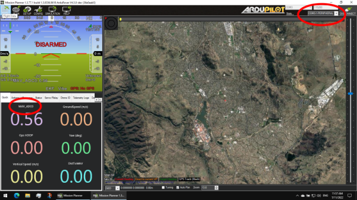

# MAVLink Sensor for the RP2040

This repository contains code for automatically sending analogue sensed values from a RP2040-based board (such as a Raspberry Pi Pico board) to a flight controller via MAVLink.

This allows the sensed values to appear in the GCS.

Examples are given in both Python and C.

## Hardware setup

### Setup:
1. Connect the RP2040 to a spare UART on the flight controller. Only the +5V, RX, TX and GND lines need to be connected
2. Connect any desired sensors to the A0, A1, A2 and A3 ports on the RP2040
3. Ensure the UART on the flight controller is set to MAVLink2, 57600 baud

## C

The [Raspberry Pi Pico SDK](https://www.raspberrypi.com/documentation/microcontrollers/c_sdk.html) is required to be installed.

NOTE: ArduPilot and the RP2040 require different versions of the arm-gcc compiler. Please be careful about which compiler is on the system path. THe RP2040 will typically use the compiler at ``/usr/bin``, whilst ArduPilot will typically use the compiler at ``/opt/gcc-arm-none-eabi-10-2020-q4-major/bin``

Use to following commands to build the program:
```
mkdir ./c/build
cd ./c/build
cmake .. -DPICO_BOARD=pico -DPICO_TOOLCHAIN_PATH=/usr/bin/
make
```

Then copy the ``./c/build/mavlink_periph.uf2`` file to the RP2040.

## Python
The [Micropython](https://micropython.org/) framework is required to be installed on the RP2040, in order to run the code.

Use the ``upload.py`` script to upload the code to the RP2040.

## Running
The code will automatically run on boot, flashing a LED each time a MAVLink heartbeat packet is received.

The RP2040 will send readings from the analogue ports A0, A1, A2 and A3 at 1 second intervals. The readings are in volts.

The readings can be viewed at a GCS, such as Mission Planner or MAVProxy.

In MAVProxy, use the following command:
```
graph NAMED_VALUE_FLOAT[ADC0].value NAMED_VALUE_FLOAT[ADC1].value NAMED_VALUE_FLOAT[ADC2].value NAMED_VALUE_FLOAT[ADC3].value
```

In Mission Planner, select the "peripheral" component, then right click in the "quick" tab and select the ADC value to display:



### Developers
Due to resource constraints in Micropython, a limited MAVLink interpreter is included (``pymavminimal.py`` and ``mavcrc.py``). Message
signing is not available. See ``main.py`` for a basic example of sending and receiving MAVLink messages.

The follow messages are supported:

```
AHRS (163)
DATA16 (169)
DATA32 (170)
DATA64 (171)
DATA96 (172)
HEARTBEAT (0)
SYS_STATUS (1)
SYSTEM_TIME (2)
GPS_RAW_INT (24)
ATTITUDE (30)
VFR_HUD (74)
COMMAND_INT (75)
COMMAND_LONG (76)
COMMAND_ACK (77)
NAMED_VALUE_FLOAT (251)
NAMED_VALUE_INT (252)
STATUSTEXT (253)
SCALED_IMU (26)
```
